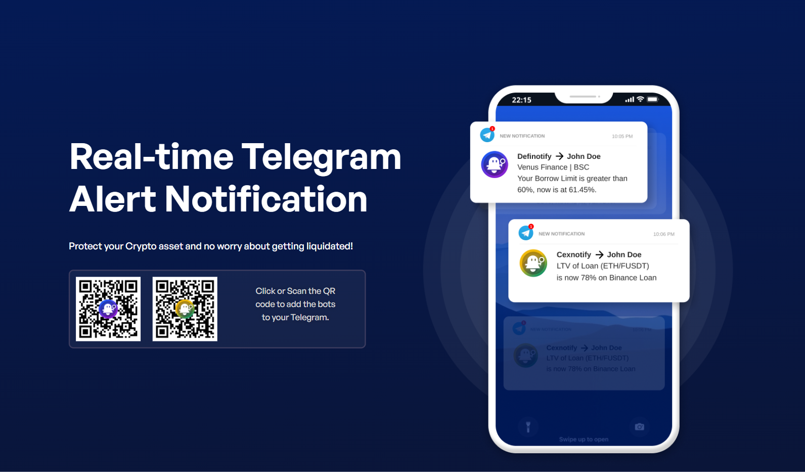
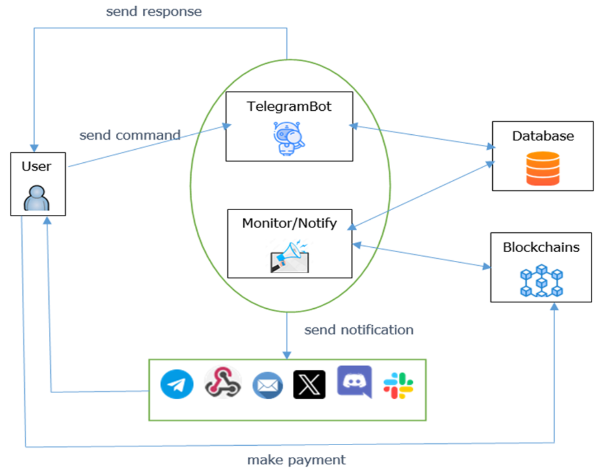

## Crypto Notify Central

- [Overview](#overview)
- [How was it created?](#how-was-it-created)
- [Our services](#our-services)
- [Why Telegram?](#why-telegram)
- [How Our Telegram Bots Work](#how-our-telegram-bots-work)
- [DeFi Notify Bot](#defi-notify-bot)
- [CexNotify Bot](#cexnotify-bot)
- [Trading Signals Bot](#trading-signals-bot)
- [Key Features](#key-features)
- [Useful links](#useful-links)

### Overview

A collection of services that empowers crypto investments.
Highly beneficial for crypto investors utilizing loan services such as margin and futures trading, as well as borrowing assets on any lending platforms.
Our services will be used for both Centralized Finance (Cefi) and Decentralized Finance (Defi) 

### How was it created?

Crypto Notify Central (formerly Definotify) was developed for my individual purpose since I have been actively borrowing assets on Venus.io - my favourite lending protocol.
Proactively monitor Borrow Limit/Health Factor on these protocols, crucial for preventing liquidation risk.
High demand from crypto investors who wanted to have a similar service like mine.
Highly potential and profitable opportunity to turn my personal project into a commercial software.

### Our services

Monitoring and Notifying:

- Lending positions on permissionless lending platforms such as Venus, Compound, AAVE, etc…
- Margin and futures trading positions (liquidation threshold + current profit) on both  Centralized & Decentralized Exchanges
- Other services: price alert, whale alert (onchain monitor, arbitrage opportunities).

**And more:**

AI trading tool (based on complicated factors like Lending platform’s interests, Funding rate, Option Trading’s max pain prices, DXY, CPI, etc…) to predict and give signals when we need to buy or sell Bitcoin in short term.

### Why Telegram?

Telegram is the main tool and popular in any crypto communities.
Telegram is flexible and reliable enough for building an application on top of it.
Potential to use Telegram advertisement platform to attract potential crypto investors.
Take a lot of time and effort to build a mobile app for the same purpose.
No need to reinvent a wheel.

### How Our Telegram Bots Work

### DeFi Notify Bot

- [Website](https://www.cryptonotifycentral.com/definotify-bot/)
- [Telegram](https://t.me/DefinotificationBot)
- [DeFi Notify (explained in 1 minute) - Youtube video](https://www.youtube.com/watch?v=4cGXJNmteVU)

### CexNotify Bot

- [Website](https://www.cryptonotifycentral.com/leveraging-your-crypto-assets-a-guide-to-binance-crypto-loans-and-managing-risks-with-cexnotify/)
- [Telegram](https://t.me/CexnotificationBot)

### Useful links

- The original [website](http://definotify.net)
- The official [website](http://cryptonotifycentral.com/) (ongoing development)
- The [DefiNotification Channel](https://t.me/definotifychannel)
- [YouTube channel](https://www.youtube.com/@cryptopnotifycentral)
- [Twitter](https://twitter.com/DefiNotify)

